# ERKAN RISNGITS

### Software Engineering · Cybersecurity · Agentic Systems

Building secure software, intelligent systems, and infrastructure.

---

## Frontier Projects

<table>
<tr>

<td width="33%" valign="top">

### Octópus

**Agentic Cybersecurity**

An agentic LLM for cybersecurity built to reason through security tasks, emit structured tool calls, and operate behind an authorization-aware runtime.

 

</td>

<td width="33%" valign="top">

### Sentira

**Signal Intelligence**

A research-driven system for transforming public discourse and news metadata into structured signals around attention, tone, and emerging change.

 

</td>

<td width="33%" valign="top">

### KΛDRΛN

**Secure Infrastructure**

A self-hosted deployment platform built around privilege separation, constrained execution boundaries, and an unprivileged control plane.

 

</td>

</tr>
</table>

---

## Tech Stack & Tools

---

## Activity

<table>
<tr>
<td width="50%" valign="top">

</td>

<td width="50%" valign="top">

</td>
</tr>
</table>

---

## 🏆 Achievements

